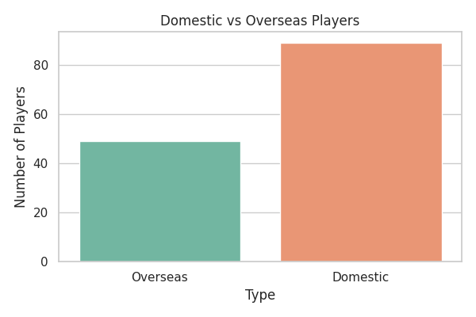
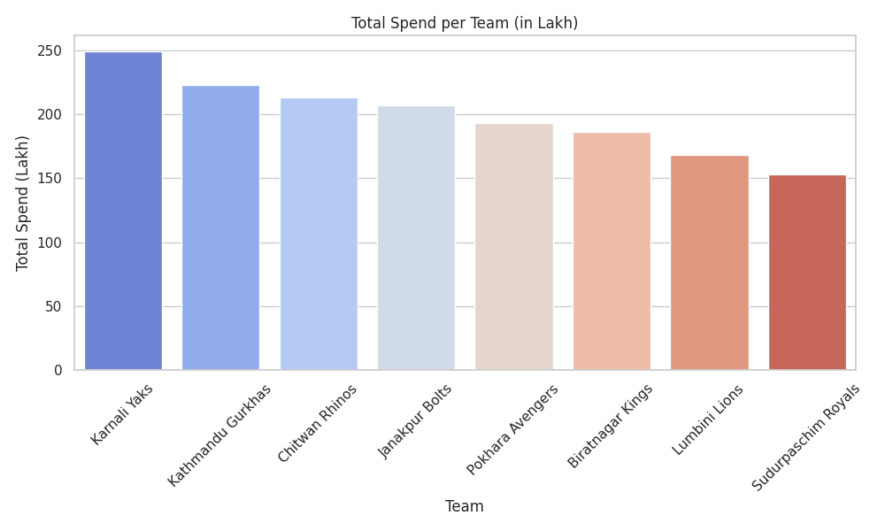
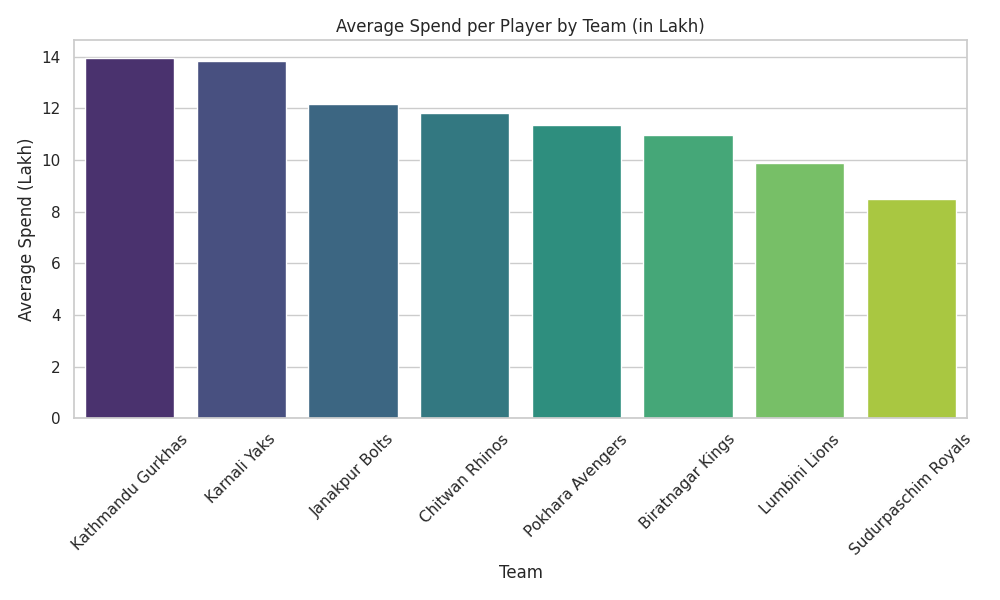
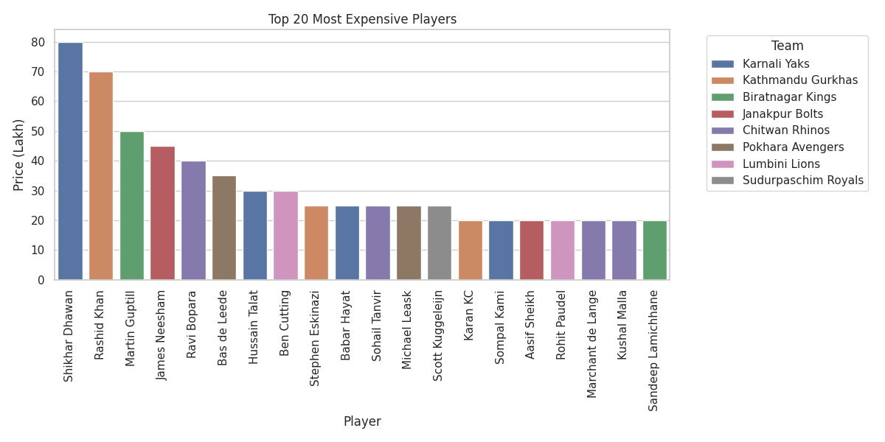
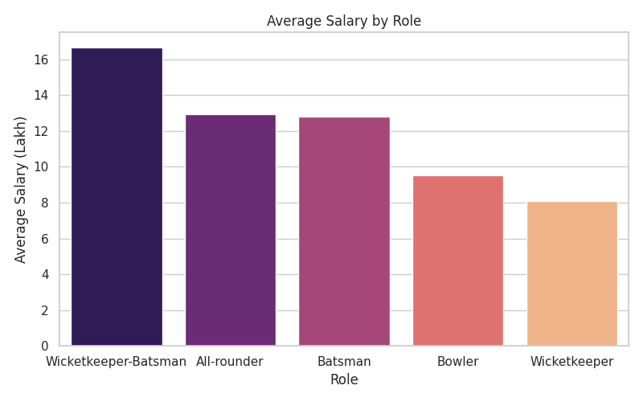
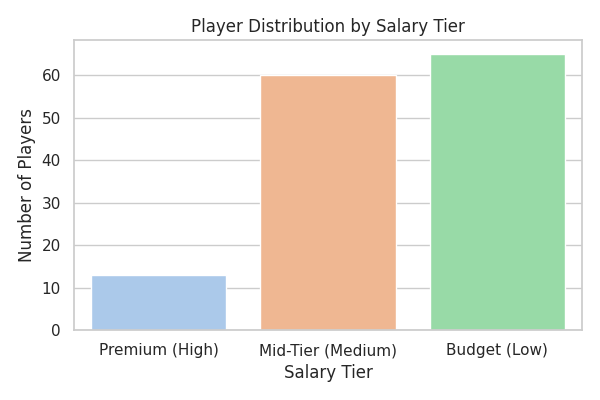
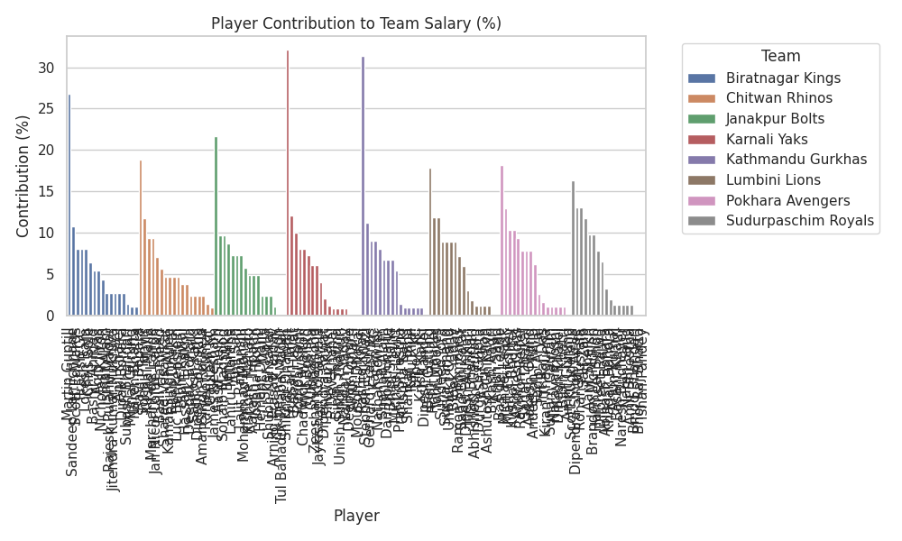

---

## ⚡ Features

1. **General Overview**
   - Total number of players
   - Total teams
   - Domestic vs Overseas players
   - Total league spending

2. **Team-wise Analysis**
   - Total spend per team
   - Average spend per player by team
   - Top 3 highest-paid players per team
   - Role-wise salary ladder within each team
   - Percentage of team budget each player contributes

3. **Player-wise Analysis**
   - Top 20 most expensive players
   - Cheapest and free players
   - Salary tier distribution (Premium, Mid-Tier, Budget)
   - Player contribution to team salary

4. **Role & Type Analysis**
   - Role-wise average salary
   - Role contribution percentage for the league
   - Role contribution percentage inside each team

---

## 🛠 Technologies Used

- **PostgreSQL**: For storing NPL players data and exporting analysis CSVs.  
- **Python (Pandas, Matplotlib, Seaborn)**: For reading CSVs and creating visualizations.  
- **CSV**: Export format for easy data analysis.

---

## 📊 Visualization

The `npl_analysis_visualization.py` script reads all CSV exports and generates plots:










All plots are saved in the `plots/` directory.

---

## 🚀 How to Run

1. **Clone the repository** (or copy files):
   ```bash
   git clone <repository_url>
   cd npl-player-insights-2024
